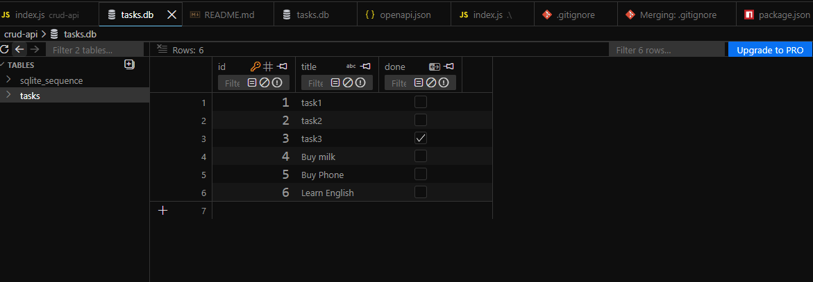
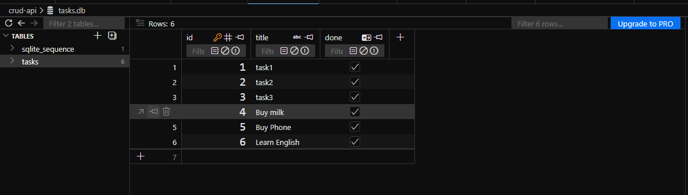
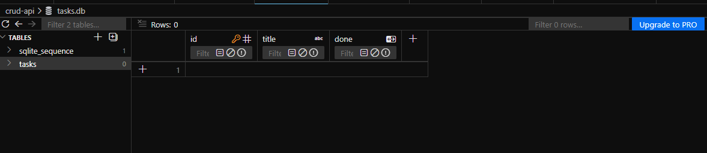
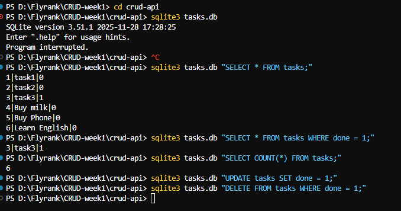

# Flyrank-Assignment-DhimasFauzan

# Task Management API (SQLite Persistent Backend)

A RESTful CRUD API built with Node.js, Express, and persistent SQLite storage (`better-sqlite3`), fully documented with Swagger UI.

---

## Features

- **Full CRUD Support**: Complete implementation of `GET`, `POST`, `PUT`, and `DELETE` endpoints.
- **Persistent Storage**: Data is saved to an embedded SQLite database (`tasks.db`) and persists across server restarts.
- **Automatic Initialization**: Automatically creates the `tasks` table and seeds default data on the first run.
- **Strict Validation**: Robust request body and ID validation returning standardized HTTP status codes (`200`, `201`, `204`, `400`, `404`).
- **Interactive Documentation**: Swagger UI documentation served live at `/docs`.

---

## Database Architecture

### Why SQLite?
- **Zero Configuration**: SQLite is a serverless, self-contained database engine. It does not require running a separate background database server process (like PostgreSQL or MySQL).
- **File-Based Persistence**: All data is stored in a single disk file, making it lightweight, fast, and easy to run locally or migrate.
- **Synchronous Performance**: Using `better-sqlite3` provides fast, synchronous query execution in Node.js without async overhead.

### Database Location
The database is stored locally in the root project folder:

```bash
crud-api/tasks.db
```

*(Note: If `tasks.db` does not exist when the server starts, the application automatically initializes the database schema and seeds initial task rows).*


## Quick Start

Run these commands in your terminal to install dependencies and start the server:

```bash
git clone <your-github-repo-url>
cd crud-api
npm install
node index.js
```

The server will start running at http://localhost:3000.

## Database Viewer & Manual SQL Queries
You can inspect and manage tasks.db using any SQLite viewer (such as DB Browser for SQLite, VS Code SQLite Viewer extension, or the sqlite3 CLI).

## Example SQL Queries Executed

- List all tasks:
```bash
SELECT * FROM tasks;
```

- Show only completed tasks:
```bash
SELECT * FROM tasks WHERE done = 1;
```

- Count all records:
```bash
SELECT COUNT(*) FROM tasks;
```

- Mark all tasks as completed:
```bash
UPDATE tasks SET done = 1;
```
Output example :



- Delete all completed tasks:
```bash
DELETE FROM tasks WHERE done = 1;
```
Output Example :


Example all outputs below:


## API Endpoints

| Method | Endpoint | Description | Status Codes |
|---|---|---|---|
| GET | `/` | API info and version metadata | 200 |
| GET | `/health` | Server health check | 200 |
| GET | `/docs` | Interactive Swagger UI documentation | 200 |
| GET | `/tasks` | Retrieve all tasks | 200 |
| GET | `/tasks/:id` | Retrieve a single task by ID | 200, 404 |
| POST | `/tasks` | Create a new task | 201, 400 |
| PUT | `/tasks/:id` | Update task title and/or done status | 200, 400, 404 |
| DELETE | `/tasks/:id` | Remove a task by ID | 204, 404 |

## Sample Request & Response (curl -i)

```bash
curl -i -X POST http://localhost:3000/tasks \
  -H "Content-Type: application/json" \
  -d '{"title": "Learn CRUD"}'
```

## Interactive Documentation (Swagger UI)
Visit http://localhost:3000/docs in your browser to view and test all endpoints directly using the interactive Swagger interface.

```bash
The Prompt :

Act as a pro backend engineer. I want to build a simple CRUD API. Use js and express. For the database, just use an array in the script for the data.

I need 5 endpoints with strict validation:


GET /tasks => get all tasks. Return 200 OK.

GET /tasks/:id =>get a single task by id. Return 200 OK, or 404 if not found.

POST /tasks =>create a new task. Title is a required string (cannot be empty or whitespace), done defaults to false. Return 201 Created. If title is empty/missing, return 400 Bad Request.

PUT /tasks/:id => update title and/or done. If body is completely empty, or if title/done are the wrong data types, return 400 Bad Request. Return 200 OK if successful, or 404 if id not found.

DELETE /tasks/:id =>delete task by id. Return 204 No Content if successful, or 404 if not found.

Also, set up Swagger UI docs at /docs using swagger-ui-express and an openapi.json file. Do not provide explanations, just the code files. 


```